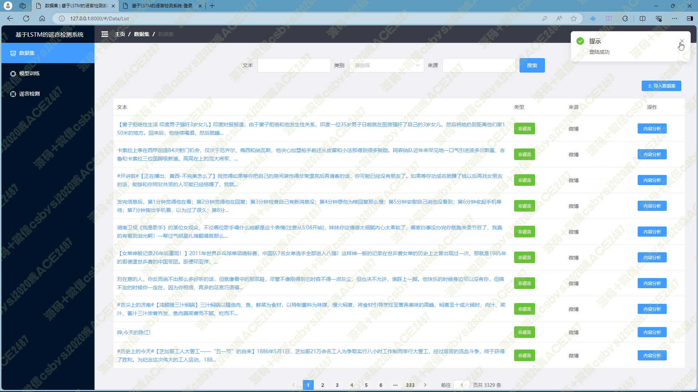
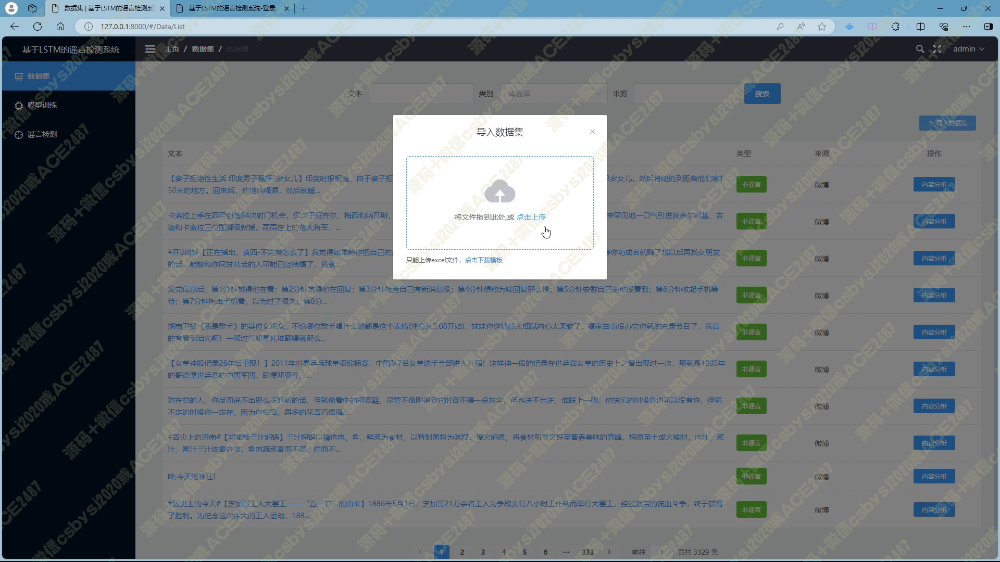
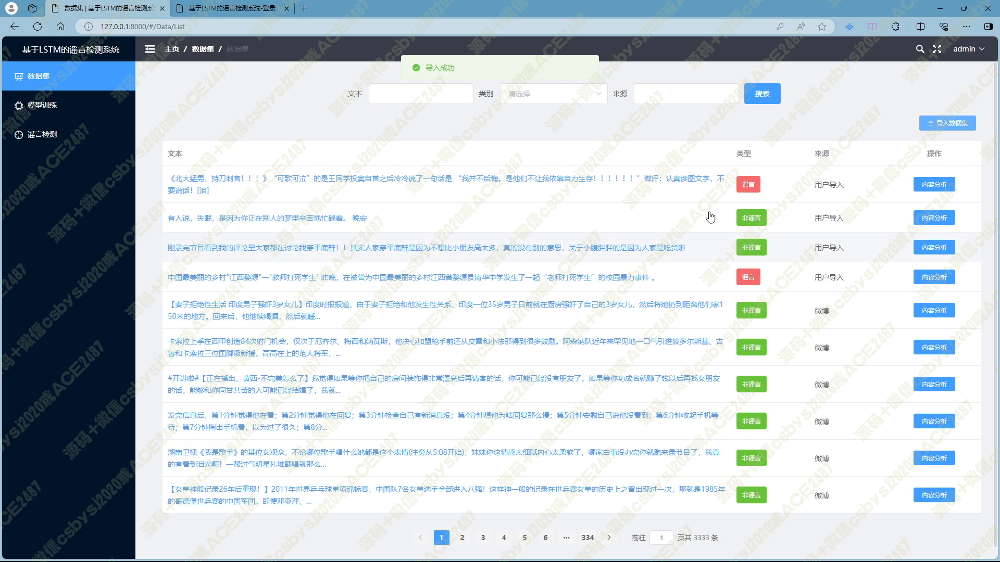
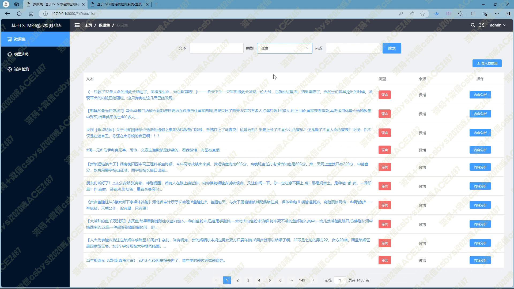
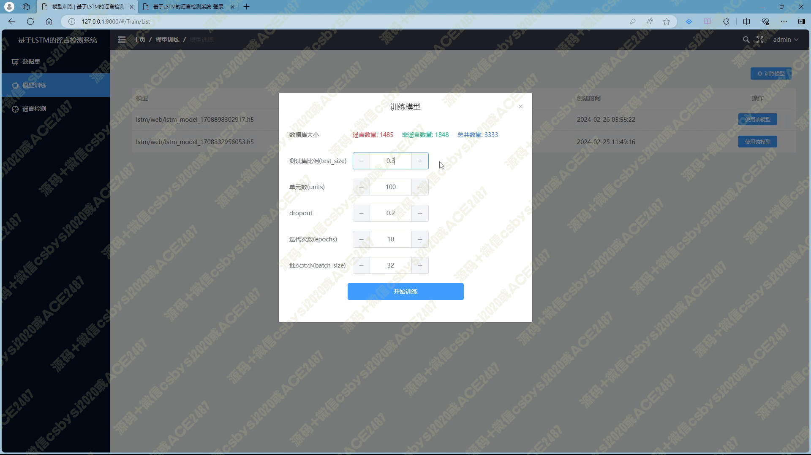
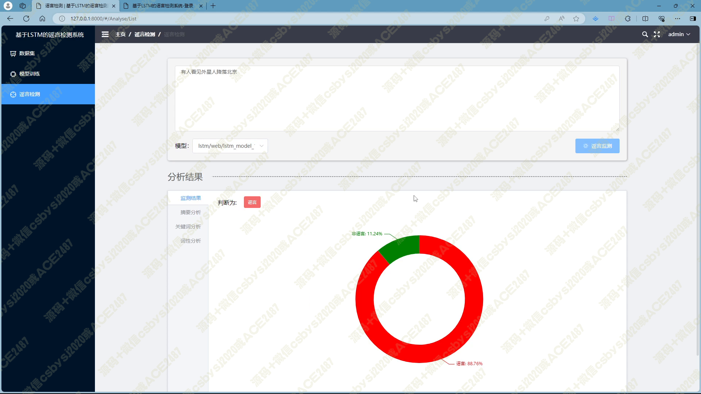
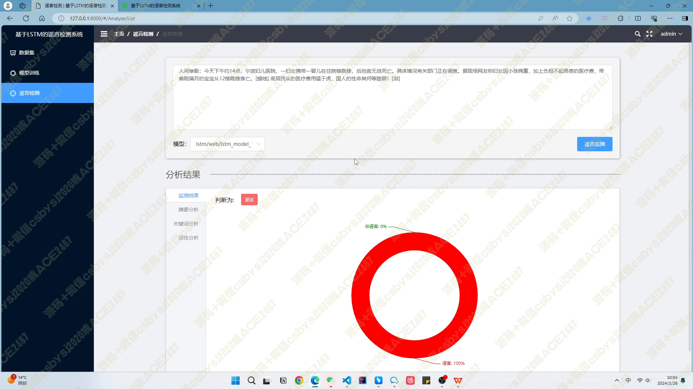

# 040 基于深度学习的谣言监测系统-设计展示

> **代码有偿获取 可接受定制 微信联系方式: csbysj2020 或 ACE2487，备注(BS)**

> 

> 

## 介绍

本项目是一款基于深度学习的谣言监测系统，利用 LSTM 模型实现对网络谣言的自动识别和监测。在互联网和社交媒体高速发展的背景下，本项目的推出具有重要意义，旨在提高谣言识别的准确性和效率，帮助公众快速辨别真伪信息，为政府、媒体和企事业单位提供有效的谣言管理工具。

本项目采用 Python 编程语言，结合 Django 后端框架和 Vue3 前端框架，使用 Element Plus UI 组件库和 ECharts 进行数据可视化。在自然语言处理方面，我们使用了 Jieba 进行中文分词，并基于 TensorFlow 和 Keras 深度学习框架构建 LSTM 模型，同时借助 SKlearn 机器学习库进行模型评估与优化。

项目实现功能包括用户登录注册、数据集管理、模型训练和谣言监测等。用户可以导入新的数据集，调整训练参数，重新训练模型，并通过输入文本进行谣言识别，系统将展示识别结果的概率、摘要分析、关键词云图和词性分析。

项目实现步骤包括数据预处理、模型训练、模型评估与优化、系统开发以及系统测试与部署。原数据集来源于清华大学推出的中文谣言数据集，具有较高的权威性和可靠性。

本项目将为网络谣言的监测与管理提供有力支持，有助于维护社会稳定和公共利益，提高公众的信息素养。

## 技术栈

- 编程语言：Python
- 后端框架：Django
- 前端框架：Vue3
- UI 组件库：Element Plus
- 数据可视化：ECharts
- 中文分词工具：Jieba
- 自然语言处理（NLP）工具
- 深度学习框架：TensorFlow、Keras
- 机器学习库：SKlearn
- 模型算法：LSTM（长短期记忆网络）

## 视频

> **点击查看 \>\>\> [https://www.bilibili.com/video/BV1TqHzeqEBs/](https://www.bilibili.com/video/BV1TqHzeqEBs/)**

## 截图

